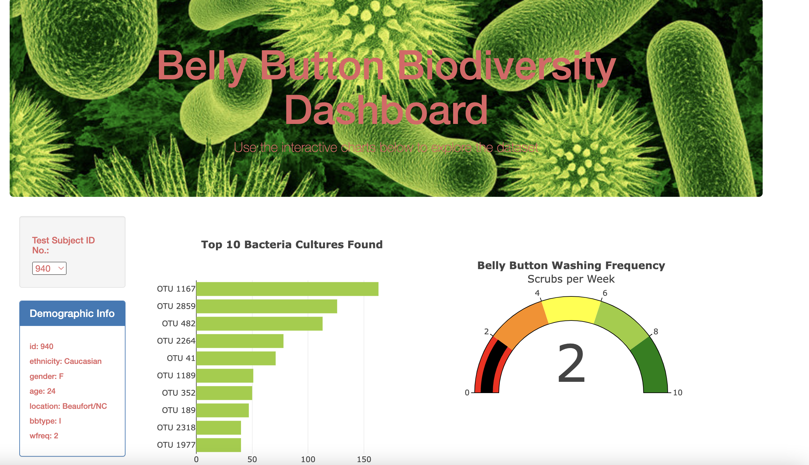
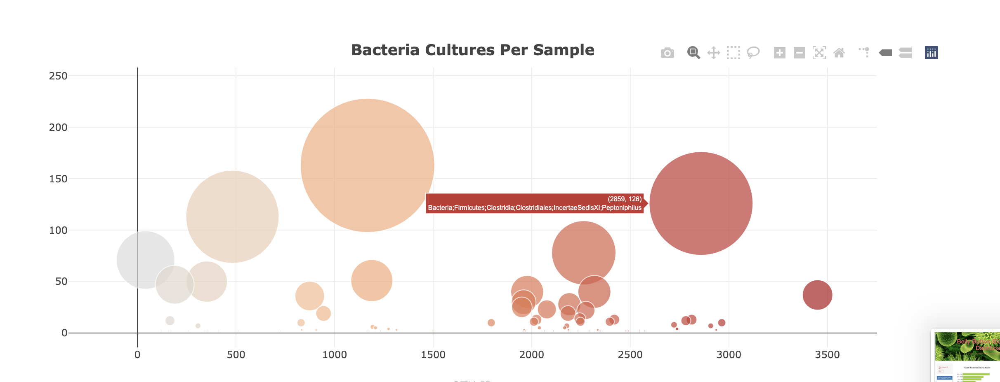
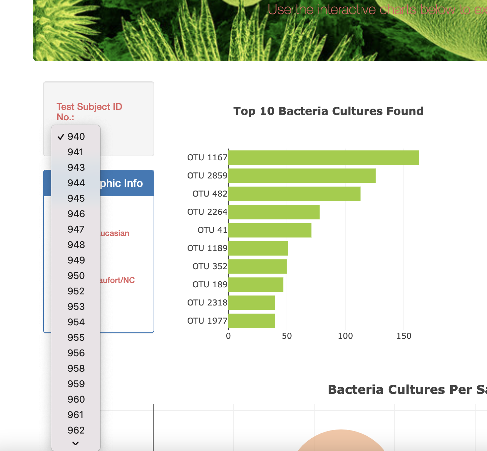

# BellyButton_Biodiversity

## Purpose
This project focuses on building an interactive dashboard to vizualize the bacterial soecues living in the navel of candidates of a ressearch about meat protein synthesis from human bacteria.

The background and design of the website was edited.
- A gauge and bar chart were added and customized
- </img>
- A bubble chart was added along with a hover menu
- </img>
- Lastly, a dropdown menu was added to interact with the dashboard. Also it allow the user to filer through the patients in the study.
- </img>
